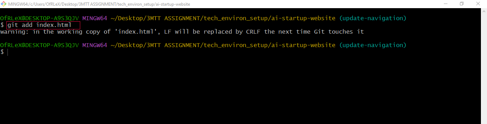

# GIT BASIC COMMANDS
In this mini project, we'll create a step-by-step project to simulate the workflow of Tom and Jerry using Git and GitHub. This hands-on project will include installation of Git, setting up a GitHub repository, cloning the repository, creating branches, making changes, and merging those changes back into the main branch.
#
#
## Part 1: Setup and initial configuration
1. Install Git:
* Visit the [Official Git Website](https://git-scm.com/) and download the version of Git for your operating system. Follow the installation instructions.

    

2. Create a GitHub Repository:
* Sign up or log in to [GitHub](https://github.com/).

    
* Click the "+" icon in the top-right corner and select "New repository".

    
* Name your repository (e.g., "ai-setup-website") and initialise it with a README file.

    
* Click "Create Repository".

3. Clone Repository:
* On your repository's page on GitHub, click the "Code" button and copy the HTTPS URL.

    
* Open your terminal or command prompt.
* Create a folder named "git-project" in the folder where you are storing all DAREY.IO related work. For example in the Desktop folder on your laptop, you may create a folder called "darey-training".
* Change directory into the "git-project".
* Clone (Download) the repository from Github using
```
git clone [Past the URL copied from GitHub]
```

* Since you just clonned your repository, your branch is `main`.
* Navigate into the repository you clonned.
```
cd ai-startup-website
```

* Create an empty file "index.html"
* Add the content below.
```
This is the Admin creating an index.html file for Tom and Jerry.
```

* Check changes has not been staged
```
git status
```

* Stage changes:
```
git add index.html
```

* Comfirm changes have been staged for commit:
```
git status
```

    Now, after staging the changes, the file name will appear in green in the terminal output. This color change signifies that the has been successfully staged, making it ready for the the next step, which is committing these to the project's history.

* Commit changes
```
git commit -m "This is my first commit"
```

This takes the staged changes and records them in the repository's history with a massage describing what was done. This commit is a milestone, marking a specific point in the project's develooment.

* Push main branch to GitHub:
```
git push origin main
```

This sends commits from your main branch on your laptop to GitHub (Remote Repository).

## Part 2: Simulating Tom and Jerry's Work
To simulate both Tom and Jerry working on the laptop, you'll switch between two branches, making changes as each charater.

1. Tom's Work:
* Navigate to the project directory you just cloned:
```
cd ai-startup-website
```
This moves you into the folder containing the cloned GitHub repository on your local machine. It's like stepping into the project's workspace.

* Check the current branch: This shows you a list of all branches in your local repository. Initially, you'll see only the "main" branch because that's the default starting point and no other branches have been created yet.
```
git branch
```

* Craete a new branch for Tom's work:
```
git checkout -b update-navigation
```

This graetes a new branch named "update-navigation" (You can name it whatever you want). The command also automatically switches to the newly created branch from the "main" branch. The command "update-navigation" is whre you'll simulate Tom's uodate to the website without affecting whatever is in the main branch.

* Chech the branch again to see namedly created branch.
```
git branch
```


Running git brand again now shows your newly created branch, indicating you're now working in this new "workspace" dedicated to Tom's navigation updates.

* Recall you created an empty file "index.html" in the main. The file will also exist in the `update-navigation-branch`: Open the `index.html` and add the content below
* Add the content below
```
This is Tom adding Navigation to the AI-website
```


This simulates Tom's contribution tio the project. This text represents the work he's doing on the navigation bar. In the real world, this will be an actual software code.

* Check changes has not been staged
```
git status
```


At this stage, Tom has modified the file, but these changes haven't been prepared for a commit in Git. This is indicated by the file name appearing in red in the terminal output, signalling that the changes are recognized by Git but yet staged.

* Stage Tom's changes:
```
git add index.html
```

This tells Git that you want to include the updates made to index.html in the next commit. It's like saying, "Okay, I'm happy with these changes and ready to record them".

* Confirm changes have been staged for commit:
```
git status
```

Now, after staging the changes, the file name will appear in green in the terminal output. This color change signifies that the file has been successfully staged, making it ready for the next step, which is committing these changes to the project's history.

* Commit Tom's changes
```
git commit -m "Update navigation bar"
```
This takes the staged changes and records them in the repository's history with a message decribing what was done. This commit is a milestone, marking a specific point in the project's development.

* Push Tom's branch to GitHub:
```
git push origin update-navigation
```


This sends Tom's commit from your local branch on your laptop to GitHub (Remote Repository). it's like publishing your workso that others (or in this case, "Jerry") can see and interact with it. This step updates the remote repository with Tom's contributions.

After completing Tom's workflow, you will now simulate Jerry,s contribution to the project. To do this, you'll;
* Switch back to the main branch
* Create a new branch for Jerry
* Make changes
* Stage, commit, and push these changes to GitHub.

1. Jerry's work:
. Switch back to the Main Branch:
```
git checkout main
```


This command switches your current working directory back to the main branch, ensuring that Jerry's changes start from the latest version of the project.

* Pull the Latest Changes:
```
git pull origin update-navigation
```


This ensures that you have latest updates from the repository, including Tom's merged changes, if any.
```
git checkout -b add-contact-info
```


This creates a new branch where Jerry will make his changes, keep them separate from the main project until they're ready to be merged.

* Open index.html and Add Contact Information: Make your changes to the index.html file by adding contact information. This simulates Jerry's task.
* Stage Jerry's Changes:
```
git add index.html
```


This command stages the changes Jerry made to the index.html file, preparing them for commit.

* Commit Jerry's changes:
```
git commit -m "Add contact information"
```


This saves Jerry's changes in the branch's history, with a message describing what was done.

* Push Jerry's Branch to GitHub:
```
git push origin add-contact-info
```


This command uploads Jjerry's branch to the GitHub repository , making it available for review and merging into the main project.

